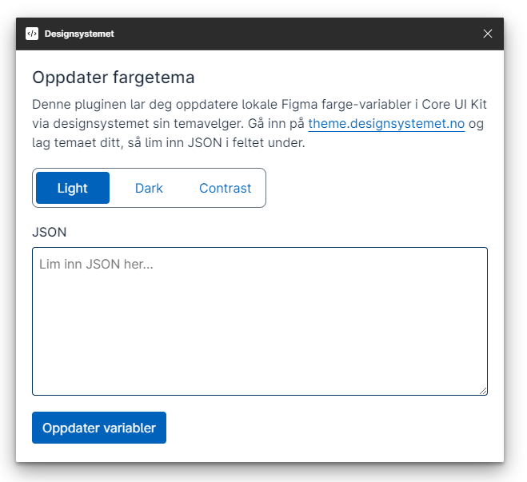

# Figma Plugin (Work in progress)

We are experimenting with a Figma plugin to update the Core UI Kit color variables with JSON from the Theme Builder, rather than have to copy the HEX values one by one like today.

