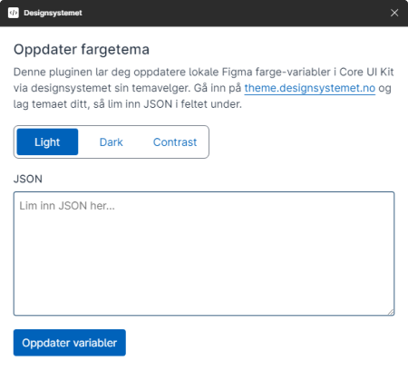

# Figma Plugin (Work in progress)

We are experimenting with a Figma plugin to update the Core UI Kit color variables with JSON from the Theme Builder, rather than have to copy the HEX values one by one like today.

## Development

1. Run `yarn figma-plugin` to build the `dist` folder and start the dev server.
2. Import the plugin in Figma by right-clicking in Figma and selecting `Plugins -> Development -> Import plugin from manifest`.
3. Select the `manifest.json` file in this folder. The `dist` folder has to be present for this to work.
4. To open the plugin right-click in Figma and select `Plugins -> Development -> Designsystemet`.

Any changes made to the plugin source code will automatically rebuild the plugin and update it in Figma. This can be tested in a Core UI Kit Figma community file.
